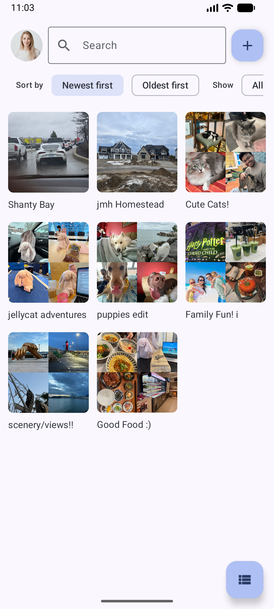
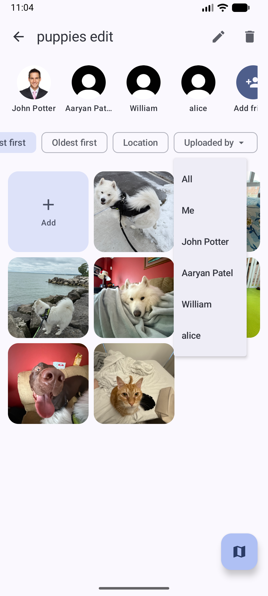
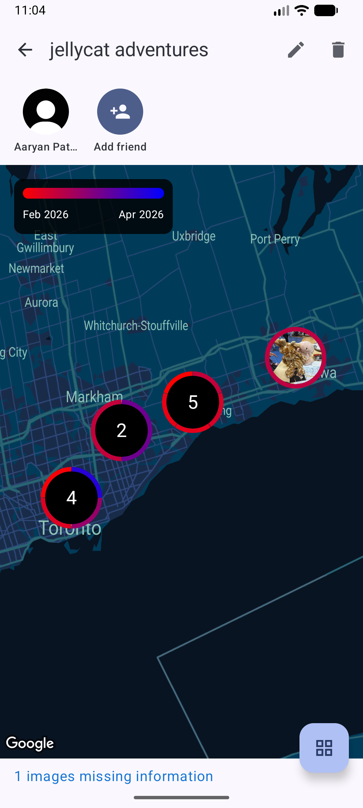
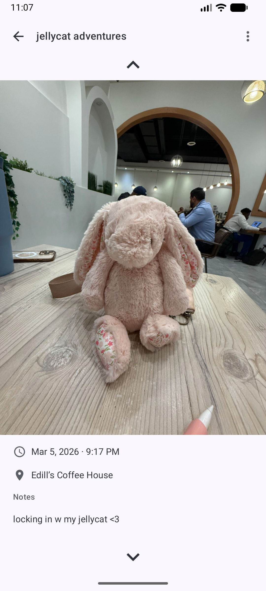
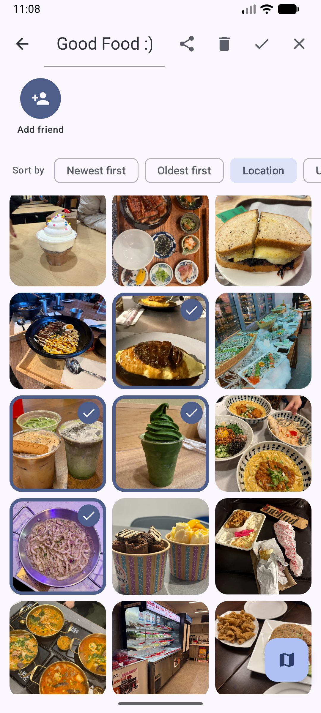

# 📍 Memento

### *Where every place has a story.*

Built by: Helena Xu, Priyanshu Ghosh, Chiara Alcantara, Alex Stanomir, Aaryan Patel, Amirdha Ravichandran

---

|  |  |
|:---:|:---:|
|  |  |
|:---:|:---:|
|  |  |
|:---:|:---:|

---

# What is Memento?

Memento is a **mobile app for capturing, organizing, and reliving meaningful memories** through an interactive and collaborative experience.

Instead of letting photos disappear into an endless camera roll, Memento turns everyday moments into structured memories tied to places, people, and experiences.

Users can capture memories using:

* 📷 Photos
* 🎥 Videos
* 🎙 Voice notes
* ✏️ Captions and written notes
* and more!

Each memory is automatically tagged with time and location, allowing users to interactively revisit moments through maps, timelines, and feeds, thus creating a living memory map of your life!

---

# Why Memento?

We take thousands of photos — but rarely revisit them. Photos sit in our camera roll, buried in unorganized chaos.

Memento solves this by helping people remember experiences, not just images.

Instead of scrolling endlessly through files, users can explore memories:

* 📍 By location (interactive map)
* 📅 By time (timeline feed)
* 👥 By people (shared albums)

Memento transforms digital media into something more meaningful, and offers a view into your friends and family's perception of the same memories.

---

# Built for Students

Memento is designed for the kinds of experiences that define university life:

* 🧳 Grad Trips: Create a shared map with friends documenting every stop along the journey.

* 🎉 Nights Out: Everyone contributes photos and voice notes to one shared album, see how different the night turned out for your friends!

* 🌍 Studying Abroad: Revisit and share where memories happened, cities, cafes, parks, and new discoveries.

* 📸 Everyday Moments: Even a regular day becomes part of your story. Take a look back at how often you locked in at DC this term!

---

# Core Features

## 📷 Capture Memories

Users can quickly capture meaningful moments directly in the app, with bulk uploads/processing.

* Take photos in-app
* Add captions or written notes
* Record voice memos
* Automatically tag time and location

These features leverage native mobile capabilities like camera access and geolocation.

## 🗺 Interactive Memory Map

Memories are visualized geographically.

Instead of a simple photo gallery, users can explore their experiences spatially:

* View memories on a map
* See journeys across cities or trips
* Click pins to relive moments

## 🤝 Collaborative Albums

Memories are often shared.

Memento allows users to:

* Create shared albums
* Invite friends
* Add memories from different perspectives
* Build a collaborative story of a trip or event

Over time, the album becomes a collective memory space for everyone involved.

## 🔔 Smart Reflection Notifications

Memento encourages users to both capture new moments and revisit old ones.

The app sends notifications when:

* You enter a new location worth documenting
* You return to a place with past memories
* It’s time for a daily or weekly recap

These reminders help transform memories into intentional reflection rather than forgotten photos.

---

# Video Demo

Check out a demo of our app [here](https://drive.google.com/file/d/1Myqr5jCdVx-NU09jSi8y_J5fGmUV9cRR/view?usp=sharing)!

---

# Why Vote for Memento?

Memento goes beyond a traditional photo gallery.

It helps people:

* ✔ Capture meaningful moments
* ✔ Reflect on their experiences
* ✔ Strengthen connections with friends
* ✔ Revisit memories through place and time

In a world where photos are constantly taken but rarely revisited, Memento creates a new way to remember the moments that matter.

Memento — where every place has a story.

